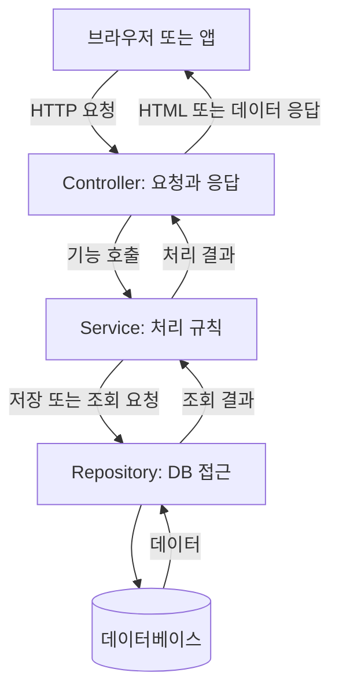

# 2026 Spring Java Week 5 — 한 프로젝트로 복습하기

이 저장소에는 **IntelliJ에서 바로 열어볼 수 있는 최소 Spring Boot 프로젝트**와 개념 노트가 함께 있습니다. 출석 항목은 제외했습니다. 수업에서 나온 기능을 작은 예제로 다시 연습하는 프로젝트이며, 교수님 원본 코드를 복사한 것은 아닙니다.

**2026-10-07 공부 내용:** [261007 / Spring Boot 프로젝트 코드와 디버깅](261007/README.md)에서 오늘의 자료와 복습 순서를 한눈에 볼 수 있습니다.

IntelliJ에서 SDK·Gradle 오류 때문에 실행 버튼이 보이지 않을 때는 [오류 보고서](261007/공부내용-IntelliJ-Gradle-오류보고서.md)를 참고하세요.

각 파일의 코드가 어떻게 연결되는지 순서대로 공부하려면 [프로젝트 코드 해설 리포트](261007/공부내용-프로젝트-코드해설.md)를 보세요.

`Map`을 포함해 코드에 나오는 말을 외우고 싶다면 [용어장과 1분 암기 카드](261007/공부내용-스프링-용어암기.md)를 보세요.

## 가장 먼저 할 일

1. GitHub에서 이 저장소를 내려받거나 `git clone`합니다.
2. IntelliJ에서 **Open**을 눌러 내려받은 `2026_spring_java_wk5_review` 폴더를 선택합니다. `build.gradle`이 보이는 폴더가 프로젝트의 시작 위치입니다.
3. Gradle 가져오기가 끝날 때까지 기다립니다. JDK는 **Java 17**을 선택합니다.
4. `src/main/java/com/example/week5/Week5Application.java`를 열고 `main` 옆의 ▶를 눌러 실행합니다.
5. Run 창에 `Started Week5Application`이 나오면 [http://localhost:8081/](http://localhost:8081/)로 접속합니다.

이전에 만든 `spring-practice`도 8081번을 사용했다면 **먼저 IntelliJ에서 그 실행을 중지**하세요. 이 프로젝트는 학습용 **H2 메모리 DB**를 사용하므로 앱을 종료하면 작성한 글이 지워집니다.

### 한 번에 연습하는 순서

| 차례 | 브라우저에서 해볼 일 | 핵심 개념 |
|---|---|---|
| 1 | `/test`, `/practice/param/hello` 접속 | 컨트롤러, ResponseBody, PathVariable |
| 2 | `/practice/add?a=2&b=3` 접속 | RequestParam → Model → Thymeleaf |
| 3 | `/practice/concat?a=Java&b=Spring` 접속 | 문자열 붙이기 |
| 4 | `/practice/multiply?a=2&b=3`와 `/api/practice/multiply?a=2&b=3` 비교 | 페이지 응답과 REST 응답 |
| 5 | `/practice/redirect` 접속 | 리다이렉트 |
| 6 | `/boards`에서 새 글 작성 → 목록 → 상세 → 수정 → 삭제 | Controller → Service → Repository → DB |
| 7 | `/api/boards` 접속 | REST 목록 JSON |

**주소창은 GET 요청만 보냅니다.** REST의 POST·PUT·DELETE는 API 도구나 아래 명령으로 확인하세요. 번호 `1`은 실제 생성된 글 번호로 바꿉니다.

```bash
curl -i -X POST http://localhost:8081/api/boards \
  -H 'Content-Type: application/json' \
  -d '{"title":"연습 글","content":"본문"}'

curl -i http://localhost:8081/api/boards/1

curl -i -X PUT http://localhost:8081/api/boards/1 \
  -H 'Content-Type: application/json' \
  -d '{"title":"수정한 글","content":"새 본문"}'

curl -i -X DELETE http://localhost:8081/api/boards/1
```

### 코드 읽는 순서

```text
Week5Application.java                  시작점
controller/PracticeController.java     파라미터·Model·페이지 응답
controller/PracticeRestController.java REST 데이터 응답
controller/BoardController.java        게시판 HTML 요청
controller/BoardRestController.java    게시판 JSON API 요청
service/BoardService.java              필요한 기능 목록
service/impl/BoardServiceImpl.java     처리와 생성자 주입
repository/BoardRepository.java        DB 접근
entity/Board.java                      DB에 저장될 게시글과 PK
resources/templates/                   HTML 화면
resources/application.properties       포트와 H2 설정
```

`@Controller`와 `@RestController`, `@RequestParam`과 `@PathVariable`, `@RequestBody`와 `@ResponseBody`를 각각 비교해보세요. 폴더를 읽은 뒤에는 글 하나를 직접 작성해서 요청이 어디를 거쳐 저장되는지 추적해보면 됩니다.

프로젝트를 검증하려면 IntelliJ의 Gradle 창에서 **Tasks → verification → test**를 실행하거나 터미널에서 `./gradlew test`를 실행합니다.

---

# 개념 노트

> 목표: 요청이 Controller → Service → Repository → DB로 이어지는 과정을 설명하고, 코드에서 각 역할을 찾을 수 있다.
>
> 수업 중 질문과 복습 내용을 재구성한 문서다. 교수님 코드의 복제본이나 과제 완료 기록이 아니다. 아래 예제는 개념을 설명하는 조각이며 실행용 전체 프로젝트가 아니다.

## 목차

1. [전체 구조](#1-전체-구조)
2. [폴더와 클래스](#2-폴더와-클래스)
3. [요청 방식](#3-요청-방식)
4. [값을 받는 방법](#4-값을-받는-방법)
5. [페이지와 데이터 응답](#5-페이지와-데이터-응답)
6. [Service와 생성자 주입](#6-service와-생성자-주입)
7. [Entity와 기본키](#7-entity와-기본키)
8. [Repository](#8-repository)
9. [게시글 하나를 조회하는 흐름](#9-게시글-하나를-조회하는-흐름)
10. [복습 순서와 오류 확인](#10-복습-순서와-오류-확인)

## 1. 전체 구조



| 이름 | 담당 역할 | 게시판 예시 |
|---|---|---|
| Controller | 요청값을 받고 적절한 기능을 호출하며 HTTP 응답을 결정 | 3번 글 조회 요청 받기 |
| Service | 업무 규칙과 처리 흐름 | 글 존재 여부·접근 권한 확인 |
| Repository | 데이터 저장소 접근 | DB에서 3번 글 찾기 |
| Entity | DB 테이블과 연결되는 자바 클래스 | 번호·제목·내용이 있는 Board |
| DB | 데이터를 보관 | 게시글 테이블 |

**Entity는 Controller 다음에 실행되는 별도 단계가 아니라, 계층에서 다루는 데이터의 표현이다.** 실제 요청은 스프링 MVC의 공통 입구인 DispatcherServlet을 거쳐 담당 컨트롤러에 전달된다.

### 스프링 컨테이너와 Bean

- **Spring**: 객체 관리와 웹 요청 처리 등 애플리케이션 개발을 지원하는 프레임워크.
- **Spring Boot**: 스프링 설정과 실행을 편하게 해주는 도구.
- **컨테이너**: 필요한 객체를 생성하고 연결하며 관리하는 곳.
- **Bean(빈)**: 컨테이너가 관리하는 객체.
- **DI(의존성 주입)**: 필요한 객체를 외부에서 전달받는 것. 스프링이 빈 사이의 연결을 처리할 수 있다.

## 2. 폴더와 클래스

수업을 이해하기 위한 구조 예시다. 현재 프로젝트에 모든 파일이 완성돼 있다는 뜻은 아니다.

```text
src/main/
├─ java/com/example/post/
│  ├─ PostApplication.java
│  ├─ controller/
│  │  ├─ BoardController.java       # HTML 화면 담당
│  │  └─ BoardRestController.java   # API 데이터 응답 담당
│  ├─ service/
│  │  ├─ BoardService.java          # 기능을 선언하는 인터페이스
│  │  └─ impl/
│  │     └─ BoardServiceImpl.java   # 기능을 구현하는 클래스
│  ├─ repository/
│  │  └─ BoardRepository.java
│  └─ entity/
│     └─ Board.java
└─ resources/
   ├─ templates/board/             # Thymeleaf HTML
   ├─ static/                      # CSS, JS, 이미지 등
   └─ application.properties
```

`impl`은 Implementation(구현)의 줄임말이다. 필수 폴더는 아니며 수업의 역할 분리 방식이다. Java 폴더는 IntelliJ에서 **New → Package**, HTML 폴더는 **New → Directory**로 만든다. IntelliJ가 빈 중간 패키지를 한 줄로 합쳐 보여줄 수도 있다.

기본 설정에서는 `PostApplication`의 패키지와 그 하위에 컨트롤러·서비스 등을 두면 자동 탐색 범위에 포함된다. `java/controller`처럼 기본 패키지 밖에 만들면 별도 설정이 필요할 수 있다.

## 3. 요청 방식

| 목적 | HTTP 방식 | 스프링 매핑 | 예시 |
|---|---|---|---|
| 조회 | GET | `@GetMapping` | `GET /api/boards/3` |
| 등록 | POST | `@PostMapping` | `POST /api/boards` |
| 전체 교체 | PUT | `@PutMapping` | `PUT /api/boards/3` |
| 부분 수정 | PATCH | `@PatchMapping` | `PATCH /api/boards/3` |
| 삭제 | DELETE | `@DeleteMapping` | `DELETE /api/boards/3` |

외우기: **조회 GET, 등록 POST, 전체 수정 PUT, 일부 수정 PATCH, 삭제 DELETE.**

- 매핑은 요청을 받을 메서드를 지정한다. 실제 저장·삭제 코드는 따로 필요하다.
- 같은 주소여도 요청 방식이 다르면 다른 메서드로 연결할 수 있다.
- 주소창에 주소를 입력하면 GET 요청이다. 주소창만으로 DELETE를 보내지는 않는다.
- 일반 HTML 폼은 GET·POST를 사용한다. 기초 수업에서 수정·삭제를 POST로 처리할 수도 있다.
- `@RequestMapping`에 HTTP 방식을 지정하지 않으면 GET만 받는 것은 아니다.

## 4. 값을 받는 방법

### PathVariable — 경로에 들어 있는 값

```java
@GetMapping("/param/{word}")
@ResponseBody
public String param(@PathVariable("word") String word) {
    return "받은 값: " + word;
}
```

`/param/hello` 요청 → `word`에 `hello` 저장 → 응답 본문에 `받은 값: hello` 표시.

### RequestParam — 이름과 값으로 전달한 파라미터

```java
@GetMapping("/add")
@ResponseBody
public int add(@RequestParam("a") int a,
               @RequestParam("b") int b) {
    return a + b;
}
```

`/add?a=1&b=2` 요청 → 응답 `3`.

| 기호 | 의미 |
|---|---|
| `?` | 쿼리 파라미터 시작 |
| `a=1` | a라는 이름으로 1 전달 |
| `&` | 다음 파라미터 구분 |

`@RequestParam`은 쿼리뿐 아니라 일반 폼 파라미터도 받을 수 있다. 위 예제에서는 a와 b가 필수이며 정수로 변환할 수 있어야 한다.

### RequestBody — 요청 본문 받기

JSON 본문을 객체로 받는 데 사용한다. 예: `public void create(@RequestBody BoardCreateRequest request)`.

**RequestBody = 받기 / ResponseBody = 보내기.** 둘은 반대 방향이다. `BoardCreateRequest` 같은 DTO는 요청 데이터를 담기 위해 직접 정의하는 클래스다.

## 5. 페이지와 데이터 응답

| 구성 | 문자열 반환의 일반적인 의미 |
|---|---|
| `@Controller` | 화면 이름을 반환 |
| `@Controller` + 메서드의 `@ResponseBody` | 문자열 자체를 응답 |
| `@RestController` | 요청 처리 메서드에 ResponseBody 기능이 기본 적용 |

페이지 컨트롤러의 `return "board/list";` → 보통 `templates/board/list.html` 선택.
REST 컨트롤러의 같은 반환문 → `board/list`라는 글자를 응답.

### Model과 Thymeleaf

```java
@GetMapping("/sum")
public String sum(@RequestParam("a") int a,
                  @RequestParam("b") int b,
                  Model model) {
    model.addAttribute("result", a + b);
    return "sum";
}
```

`@Controller` 클래스 안에서 사용하며, `Model`은 `org.springframework.ui.Model`을 import한다. `templates/sum.html`의 예시:

```html
<!DOCTYPE html>
<html lang="ko" xmlns:th="http://www.thymeleaf.org">
<head><meta charset="UTF-8"><title>더하기</title></head>
<body><p th:text="${result}">결과</p></body>
</html>
```

주소의 값 → 자바 계산 → Model에 담기 → Thymeleaf가 HTML에 넣기 → 브라우저 응답.

### Redirect와 콘솔 출력

- 페이지 컨트롤러의 `return "redirect:/";`는 브라우저에 홈으로 다시 요청하도록 응답한다.
- `System.out.println()`은 IntelliJ의 Run 창에 출력한다. 웹 화면 출력이 아니다.
- `/param/hello` 접속 후 홈으로 이동하는 코드라면 주소가 `/`로 바뀌는 것은 정상이다.

### AJAX

자바스크립트가 서버에 비동기 요청을 보내고, 응답을 받아 화면 일부를 바꾸는 방식이다. 페이지 전체를 이동하지 않아도 된다. `fetch` 등으로 요청할 수 있다. 데이터 응답에는 `@ResponseBody`나 `@RestController`를 사용할 수 있으며, 객체는 보통 JSON으로 변환된다.

## 6. Service와 생성자 주입

인터페이스는 **어떤 기능이 있는지**, 구현체는 **실제로 어떻게 처리하는지** 정의한다.

```java
public interface BoardService {
    Board get(Long id);
}
```

```java
@Service
public class BoardServiceImpl implements BoardService {
    private final BoardRepository boardRepository;

    public BoardServiceImpl(BoardRepository boardRepository) {
        this.boardRepository = boardRepository;
    }

    @Override
    public Board get(Long id) {
        return boardRepository.findById(id)
                .orElseThrow(() -> new ResponseStatusException(
                        HttpStatus.NOT_FOUND, "게시글이 없습니다."));
    }
}
```

학습용 예시로 404 오류 변환을 서비스에 넣었다. 규모가 커지면 도메인 예외와 HTTP 예외 처리를 분리하기도 한다. 예제에는 `@Service`, `HttpStatus`, `ResponseStatusException` 및 프로젝트 클래스의 import가 필요하다.

**생성자 읽는 법**

1. 이름은 클래스 이름과 같고 대소문자를 맞춘다.
2. 반환형이 없다. `void`도 적지 않는다.
3. 괄호의 Repository는 외부에서 전달받는 객체다.
4. `this.boardRepository`는 클래스의 필드이고 오른쪽은 전달받은 매개변수다.
5. 생성자가 하나인 스프링 빈에서는 `@Autowired`를 생략할 수 있다.

인터페이스와 구현체 분리는 선택이다. 구현체가 여러 개라면 어떤 빈을 주입할지 추가 지정이 필요할 수 있다.

## 7. Entity와 기본키

아래는 PK 개념을 보기 위한 엔티티 예시다.

```java
import jakarta.persistence.Entity;
import jakarta.persistence.GeneratedValue;
import jakarta.persistence.GenerationType;
import jakarta.persistence.Id;

@Entity
public class Board {
    @Id
    @GeneratedValue(strategy = GenerationType.IDENTITY)
    private Long id;

    private String title;

    protected Board() { } // JPA가 사용할 기본 생성자

    public Board(String title) {
        this.title = title;
    }

    public Long getId() { return id; }
    public String getTitle() { return title; }
}
```

| 표시 | 뜻 |
|---|---|
| `@Entity` | JPA가 관리하는 엔티티 클래스 |
| `@Id` | 엔티티 식별자 필드 지정 |
| `@GeneratedValue` | 식별자 자동 생성 방식 지정 |
| `IDENTITY` | DB의 자동 증가 기능 사용. DB 지원 필요 |

PK는 행을 구분하는 기본키다. DB에 저장된 PK는 중복·NULL을 허용하지 않는다. JPA 엔티티에는 `@Id` 또는 `@EmbeddedId` 등으로 정의한 식별자가 필요하다. 필드 이름만 `id`로 적는 것으로는 충분하지 않다.

자동 생성 방식에서 **저장 전 객체의 id가 null인 것**과 **식별자 선언 자체가 없는 것**은 다르다. `Long`은 null을 표현할 수 있고 기본형 `long`은 표현할 수 없다.

### Long과 랜덤 ID

| 선택 | 특징 |
|---|---|
| Long + 자동 증가 | 작고 확인하기 쉬우며 간단한 게시판의 내부 PK로 실용적 |
| 랜덤 UUID | 다음 값을 추측하기 어렵고 여러 곳에서 독립 생성하기 편함 |

String은 자료형일 뿐 자동 난수 생성 기능이 아니다. UUID도 버전에 따라 시간 정보가 포함될 수 있다. 랜덤 ID라도 접근 권한 확인은 필요하다. 모든 프로젝트에 정답인 PK 자료형은 없다.

## 8. Repository

```java
import org.springframework.data.jpa.repository.JpaRepository;
// 다른 패키지에 있다면 Board의 import도 필요하다.

public interface BoardRepository extends JpaRepository<Board, Long> {
}
```

`Board`는 엔티티 타입, `Long`은 식별자 타입이다. Spring Data JPA가 구현 객체를 제공한다. 이 방식의 인터페이스에는 보통 별도의 `@Repository`가 필요 없다.

| 메서드 | 역할 |
|---|---|
| `save(board)` | 엔티티 상태에 따라 저장 또는 병합 |
| `findById(id)` | ID로 조회. 없을 수 있으므로 Optional 반환 |
| `findAll()` | 전체 목록 조회 |
| `deleteById(id)` | ID로 삭제 |

실제 실행에는 Spring Data JPA 의존성, DB 드라이버·연결 설정 등이 필요하다. 인터페이스만 만들었다고 DB 연결까지 완료되는 것은 아니다.

## 9. 게시글 하나를 조회하는 흐름

```java
@RestController
@RequestMapping("/api/boards")
public class BoardRestController {
    private final BoardService boardService;

    public BoardRestController(BoardService boardService) {
        this.boardService = boardService;
    }

    @GetMapping("/{id}")
    public Board get(@PathVariable("id") Long id) {
        return boardService.get(id);
    }
}
```

학습용으로 엔티티를 직접 반환했다. 실제 API에서는 공개할 필드를 정한 응답 DTO를 사용하기도 한다. 웹 어노테이션과 프로젝트 타입은 해당 패키지에서 import해야 한다.

```text
GET /api/boards/3
→ Controller가 3을 Long id로 받음
→ 주입된 BoardService를 호출
→ BoardServiceImpl이 Repository.findById(3L) 호출
→ JPA가 DB에서 조회
→ 결과가 있다면 Board 반환, 없다면 예제에서는 404
→ 컨트롤러가 결과를 응답 데이터로 보냄
```

이 순서를 코드에서 손가락으로 따라갈 수 있으면 C·S·R의 기본 흐름을 이해한 것이다.

## 10. 복습 순서와 오류 확인

### 순서대로 직접 해보기

- [ ] GET·POST·PUT·PATCH·DELETE의 차이를 말한다.
- [ ] `/hello`에서 HTML 화면을 연다.
- [ ] `/add?a=1&b=2`에서 두 숫자를 받는다.
- [ ] `/param/hello`에서 경로의 hello를 받는다.
- [ ] Model에 합계를 담고 Thymeleaf로 출력한다.
- [ ] 같은 결과를 ResponseBody로 응답해 차이를 확인한다.
- [ ] Board 엔티티와 Long 식별자를 선언한다.
- [ ] BoardRepository의 엔티티·ID 타입을 확인한다.
- [ ] ServiceImpl에 Repository를 생성자로 주입한다.
- [ ] Controller에 Service를 생성자로 주입한다.
- [ ] 게시글 조회 요청이 DB까지 가는 흐름을 설명한다.

체크박스는 자기 점검용이다. 수업 출석이나 실제 과제 완료를 뜻하지 않는다.

### 자주 만난 오류

| 상황 | 먼저 확인할 것 |
|---|---|
| `cannot find symbol RequestMapping` | 정확한 import가 있는지 |
| String 반환 메서드 오류 | 모든 필요한 경로에서 값을 return하는지 |
| HTML 대신 파일 이름만 나옴 | RestController/ResponseBody를 붙였는지 |
| HTML을 못 찾음 | templates 위치와 return 경로·대소문자 |
| 홈으로 이동하고 출력이 안 보임 | redirect와 println을 사용했는지. Run 창 확인 |
| JPA 식별자 오류 | jakarta.persistence.Id를 올바르게 지정했는지 |
| 서비스 빈을 못 찾음 | Service 등록과 기본 패키지 하위 위치 |
| 다른 페이지 또는 포트 충돌 | 다른 프로그램이 같은 포트를 쓰는지 |

이전 spring-practice 실습은 `server.port=8081`로 설정했다. 다른 프로젝트의 실제 포트는 설정과 실행 로그를 확인한다. `Tomcat started on port ...`와 `Started ...Application`은 시작 성공을 뜻하며, 개별 기능이 모두 정상이라는 뜻은 아니다.

### 1분 암기

> Controller = 요청·응답 / Service = 처리 규칙 / Repository = DB 접근 / Entity = DB 데이터의 자바 표현.
>
> PathVariable = 경로 값 / RequestParam = 요청 파라미터 / RequestBody = 요청 본문 / ResponseBody = 응답 본문.
>
> 생성자는 클래스 이름과 같고 반환형이 없다. 필요한 객체는 생성자로 전달받는다.

## 공식 참고 문서

- [Spring — ResponseBody와 RestController](https://docs.spring.io/spring-framework/reference/web/webmvc/mvc-controller/ann-methods/responsebody.html)
- [Spring — 생성자와 Autowired](https://docs.spring.io/spring-framework/reference/core/beans/annotation-config/autowired.html)
- [Spring Data JPA — 시작하기](https://docs.spring.io/spring-data/jpa/reference/jpa/getting-started.html)

정리 기준: 2026-09-30, Java·Spring Boot 수업 복습용.
